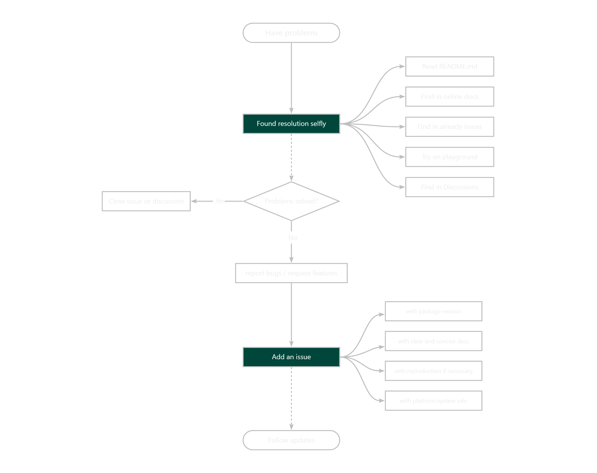
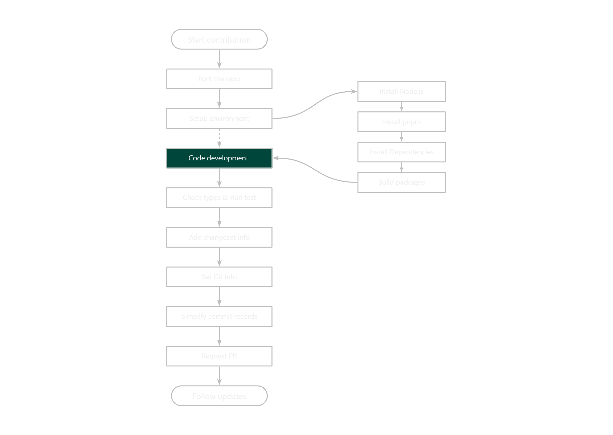

# Contributing Guide

Hi! We're really excited that you're interested in contributing to WhiteBlock!

Before starting your contribution, please read through the following guide.

## Issue Workflow



## Contribution Workflow


### Fork the Repo
To develop locally, fork the Vite repository and clone it in your local machine.

You can see [How to fork a repo](https://help.github.com/articles/fork-a-repo/) & [How to clone a repo](https://help.github.com/articles/cloning-a-repository/) if you have never used.

### Setup environment
This repo is a monorepo using pnpm workspaces. And the package manager must be [pnpm](https://pnpm.io/).

#### Install Node.js & pnpm
Check your currently used Node.js version with the following command:
```bash
node -v
pnpm -v
```
We recommend using Node.js 20.x & pnpm 9.x. 

If you do not have Node.js installed in your current environment, you can use [nvm](https://github.com/nvm-sh/nvm) or [fnm](https://github.com/Schniz/fnm) to install it.

#### Install Dependencies
```sh
pnpm install
```

#### Build packages

Run the `build` script to build all packages (this will take some time, but is necessary to make ensure all packages are built)
```sh
pnpm build
```

### Code development

#### Develop `docs` and `packages/core`
```sh
pnpm docs:dev
```

#### Develop other package
Switch to the target package directory and run:
```sh
pnpm dev
```

### Check types & Run test
```sh
pnpm type
```
```sh
pnpm test
```

### Add changeset info
Run `pnpm change` add code changes info for version updates.
```sh
pnpm change
```

### Set Git info
Check git client configs is already:
```sh
git config --list | grep email
git config --list | grep name
```
Set the email to global config:

```sh
git config --global user.name "YOUR_NAME"
git config --global user.email "YOUR_EMAIL"
```

Set the email for local repo:

```sh
git config user.name "YOUR_NAME"
git config user.email "YOUR_EMAIL"
```

### Simplify commit records

Before request a PR, you are recommended to simplify your commit records of this PR use `git base`.

### Request PR
Request a Pull Request in your repo.

By default, merge your code in to your repo's `main` branch and request PR to origin repo's `main` branch.

Request PR into a special branch also allowed if necessary. 


### Follow updates
Follow the latest state or discussions in the PR details on Github.
